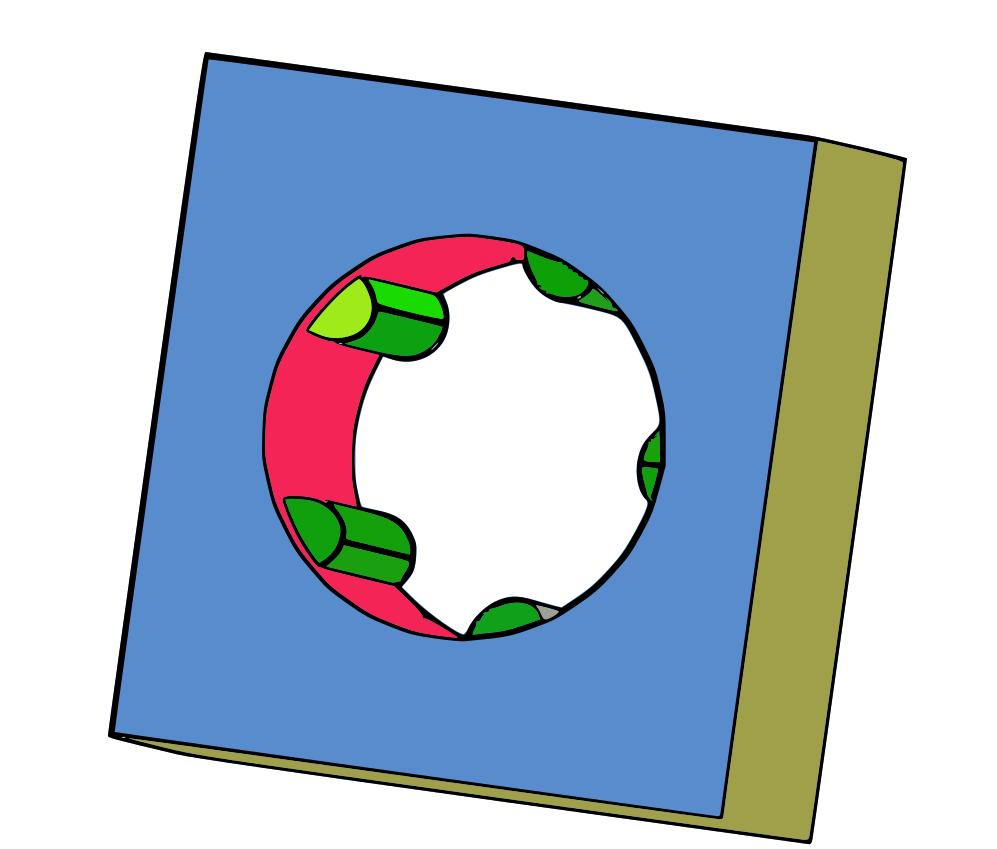

# GrabBag
A set of miscellaneous tools for FreeCAD. It's not a workbench, it's a collection of loose tools to be included in custom toolbars.

## PathHelix 
Create a helix that follows a selected path

Select a path and the Path Helix tool. Adjust the helix in the data pane. The helix will always be the full length of it's Spine. Count and Pitch are connected. When one is adjusted in the data pane, the other changes automatically to accomodate.

If a feature with a single edge is selected in the Guide field of the data pane, the radius will be adjusted continuously to touch the guide. The guide edge must intersect the normal of the path at all points.

## Extruder 
Given an object containing multiple shapes, extrude each shape individually along its normal.
Especially useful for a ShapeString copied into a polar lattice in Lattice2

## NormalLine 
Create a line normal to a face or a closed edge. A DiscretizedEdge is a special case, in that case, a line normal to the overall shape is made at every sidcrete point. The Angle parameter in the data pane can tilt the line towards/away from the geometric center of the shape.

## PipeLoft 
Lofts from one face to another in the Part workbench. Works more like the loft tool in PartDesign.

## WireBinder 
Works similar to sub-object shape binder, but selects shape wires by number from the feature it is applied to. Notably, connected lines in a sketch will form a single wire.

## Recompose 
Automatically split a curve using several different approaches. Useful for creating a sweep along a path that would otherwise self-intersect.

## TearDrop 
Create a hole cutting tool with a slight tear drop shape at the top for improved printability on an FDM 3D printer.

## RibThread 
Create a hole cutting tool that leaves ribs in the hole suitable for cutting threads with a machine bolt. Commonly used in 3D printed parts.

## Install
Just clone this repository in your FreeCAD/Mod directory, then (re)start FreeCAD.
